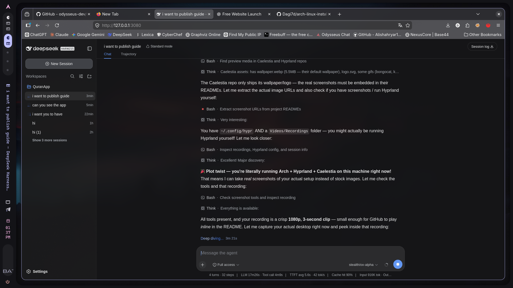

# 🐧 The Easiest Way to Install Arch Linux

> **A complete beginner-friendly guide** — no prior Linux experience required.
> We'll use the official **`archinstall`** script, which turns the famously "hard" Arch install into answering a few questions in a menu.

---

## 📖 Table of Contents

- [What your finished setup will look like](#-what-your-finished-setup-will-look-like)
- [Why this guide?](#-why-this-guide)
- [What you need](#-what-you-need)
- [Part 1 — Download the Arch ISO](#part-1--download-the-arch-iso)
- [Part 2 — Create a bootable USB drive](#part-2--create-a-bootable-usb-drive)
- [Part 3 — BIOS/UEFI settings](#part-3--biosuefi-settings)
- [Part 4 — Boot the installer](#part-4--boot-the-installer)
- [Part 5 — Connect to the internet](#part-5--connect-to-the-internet)
- [Part 6 — Run `archinstall` ✨](#part-6--run-archinstall-)
- [Part 7 — Reboot into your new Arch system](#part-7--reboot-into-your-new-arch-system)
- [Part 8 — Post-install setup (do these first)](#part-8--post-install-setup-do-these-first)
- [Part 9 — Bonus: Hyprland + Caelestia 🌊](#part-9--bonus-hyprland--caelestia-)
- [Troubleshooting](#-troubleshooting)
- [FAQ](#-faq)
- [Useful resources](#-useful-resources)

---

## 🖥️ What your finished setup will look like

Follow this guide and you'll end up with a clean, modern desktop that looks roughly like this — Caelestia's glassy top bar, a tiling/floating Hyprland setup, and colors auto-generated from **your** wallpaper:

```
┌────────────────────────────────────────────────────────────┐
│ 1  2  3  4  5      arch-pc   vol 80%   21:47   ⏻           │
│                                                            │
│   ╭─ kitty ──────────────────────────────────╮             │
│   │ ❯ fastfetch                              │             │
│   │                                          │             │
│   │    OS      Arch Linux x86_64             │             │
│   │    WM      Hyprland (Wayland)            │             │
│   │    Theme   Caelestia                     │             │
│   │    CPU     AMD Ryzen 7 7800X3D           │             │
│   │    GPU     NVIDIA RTX 4070               │             │
│   │    Memory  2.1 GiB / 32 GiB              │             │
│   │                                          │             │
│   ╰──────────────────────────────────────────╯             │
│                                                            │
│        ╭────────────────────────╮                          │
│        │ [ok] System updated!   │                          │
│        │ 813 packages upgraded  │                          │
│        ╰────────────────────────╯                          │
│                                                            │
│  super+q terminal · super+d launcher · super+v float       │
└────────────────────────────────────────────────────────────┘
```

**A day in the life with your new system:**

- ⏻ **Power on** → systemd-boot → themed SDDM login screen
- 🌅 **Desktop fades in** — your wallpaper, soft shadows, animated window transitions, and the Caelestia bar on top (workspaces, media, notifications, clock)
- ⌨️ `Super + D` → a blurred dashboard with weather, calendar and media controls
- 🖼️ Run `caelestia wallpaper set ~/Pictures/Wallpapers/new.jpg` → the **entire UI re-colors itself** to match the new image instantly
- 📦 `sudo pacman -Syu` in kitty → a toast pops up: *"System updated"* ✅
- 🔒 Walk away → `Super + L` locks with hyprlock: blurred wallpaper + big clock

> [!TIP]
> **Maintainer note:** to show *real* screenshots instead of the sketch above, save them as `.github/assets/desktop.png`, `.github/assets/launcher.png` etc. in this repo, then un-comment these lines:
>
> <!--
> 
> 
> -->

---

## 💡 Why this guide?

People say installing Arch Linux is hard because the classic method requires typing **30–50 manual commands** (partitioning, mounting, pacstrap, genfstab, bootloader…).

But since 2021, the official installation ISO ships with **`archinstall`** — a guided installer that asks you plain questions and does all of that automatically. That's what we'll use here. It is **100% official**, maintained by Arch developers themselves.

> [!TIP]
> **The whole process looks like this:**
> Flash USB → Boot → Connect to Wi-Fi → Run `archinstall` → Answer ~12 easy questions → Reboot. Done. ⏱️ *~20 minutes.*

---

## 🧰 What you need

| Item | Requirement |
|---|---|
| 💾 USB flash drive | **4 GB or larger** (everything on it will be erased!) |
| 💻 Computer | x86_64 PC, at least **2 GB RAM** and **20 GB free disk space** |
| 🌐 Internet | Wired connection, or Wi-Fi (we'll connect in Part 5) |
| ⚠️ Backup | **Back up important files first** — the disk gets wiped! |
| ⏲️ Time | About 20–30 minutes |

> [!WARNING]
> This guide installs Arch on a computer where it will be the **only operating system**. If you want to dual-boot with **Windows**, read [the FAQ](#-faq) first.

---

## Part 1 — Download the Arch ISO

1. Go to the official download page: **<https://archlinux.org/download/>**
2. Pick any mirror near you and download the latest `archlinux-x86_64.iso`
3. *(Optional but smart)* Also download the `.sig` file and verify the signature — instructions are right on that same page.

> [!NOTE]
> Arch uses a **rolling release**: there is only ever ONE version — the latest. Always grab the newest ISO, even if it says a newer month than you expected.

---

## Part 2 — Create a bootable USB drive

Pick the tool for the system you're using **right now**:

### 🪟 On Windows — Rufus (easiest)

1. Download **[Rufus](https://rufus.ie)** (portable version is fine).
2. Plug in your USB stick.
3. Device = your USB • Boot selection = the Arch `.iso` you downloaded.
4. Leave everything else at defaults → click **START** → choose **Write in DD Image mode** if asked → wait.

### 🐧 On Linux — `dd`

```bash
# Find your USB device name (look for something like /dev/sdX — NOT a partition like sdX1)
lsblk

# Write the image (replace sdX with YOUR device, e.g. /dev/sdb)
sudo dd if=archlinux-x86_64.iso of=/dev/sdX bs=4M status=progress oflag=sync
```

> [!CAUTION]
> `dd` will **erase the target device completely**. Triple-check the device name — writing to your hard drive by mistake destroys it.

### 🍎 On macOS / anywhere else — balenaEtcher

Download **[balenaEtcher](https://etcher.balena.io)**, select the ISO, select the USB, click **Flash**. Done.

### 🔥 Alternative: Ventoy (flash once, reuse forever)

If you plan to try multiple Linux distros, install **[Ventoy](https://www.ventoy.net)** on the USB once — afterwards you can just drag-and-drop ISO files onto the stick and boot them. No reflashing ever again.

---

## Part 3 — BIOS/UEFI settings

1. Restart the computer and press the boot-menu key during startup:

   | Brand | Key |
   |---|---|
   | Asus | `F8` or `Esc` |
   | MSI | `F11` |
   | Gigabyte | `F12` |
   | ASRock | `F11` |
   | Dell / Lenovo / HP / Acer | `F12` / `F12` / `F9` / `F12` |

2. Choose your **USB drive** under the **UEFI** entry (preferred over legacy/CSM).
3. If the USB doesn't show up, enter BIOS Setup (`F2` / `Del`) and:
   - **Disable Secure Boot** (Arch doesn't sign its bootloader for it out of the box)
   - Make sure UEFI mode is enabled
   - Save (`F10`) and try again.

---

## Part 4 — Boot the installer

You'll land at a menu:

```
Arch Linux install medium (x86_64, BIOS/UEFI)   ← choose this (default)
```

Press **Enter** and wait ~15 seconds. You'll get a black screen with a root shell:

```
root@archiso ~ #
```

That's it — you're running Arch from the USB. Nothing has been installed yet.

---

## Part 5 — Connect to the internet

An internet connection is **required** for the install.

**Wired (Ethernet):** usually just works. Skip ahead.

**Wi-Fi:** run:

```bash
iwctl
```

Then inside the `[iwd]#` prompt:

```
station wlan0 scan
station wlan0 get-networks
station wlan0 connect "YourWiFiName"
```

(Type your Wi-Fi password when asked, then type `exit` to leave.)

**Verify it works:**

```bash
ping -c 3 archlinux.org
```

If you see replies — you're online. ✅

> [!TIP]
> Non-US keyboard? Set your layout now: `loadkeys de` (German), `loadkeys fr` (French), `loadkeys es` (Spanish), etc.

---

## Part 6 — Run `archinstall` ✨

Now for the magic moment:

```bash
archinstall
```

A friendly menu appears. Go through it **top to bottom**. Here's exactly what to answer:

| Menu item | What to choose | Why |
|---|---|---|
| **Language** | Your language (or English) | Menus/messages language |
| **Keyboard layout** | `us` (or yours) | Matches your physical keyboard |
| **Mirror region** | Your country / nearest region | Faster package downloads |
| **Locale language / encoding** | Keep defaults (`en_US.UTF-8`) | Safe choice |
| **Drive(s)** | Select your **internal disk** ⚠️ | Where Arch goes — everything on it is erased! |
| **Disk layout** | → `Wipe all selected drives` → `Use a best-effort default partition layout` | Let the installer do the work |
| **Filesystem** | `ext4` (simple & solid) or `btrfs` (modern, supports snapshots) | Both are great; ext4 is simplest |
| **Bootloader** | `Systemd-boot` (simplest) — or `GRUB` if dual-booting | See FAQ |
| **Swap** | `True` | Prevents freezes when RAM fills up |
| **Hostname** | Anything you like, e.g. `arch-pc` | Your computer's network name |
| **Root password** | Set a strong one, **write it down** | Emergency/admin access |
| **User account** | Add yourself → set password → **mark as `sudo`** ✅ | This is the account you'll log into daily |
| **Profile** | → `Type` → `Desktop` → pick a desktop | This installs a full graphical desktop! |
| **Graphics driver** | Auto-detect works well (or pick `NVIDIA`/`AMD`/`Intel` explicitly) | Enables proper display acceleration |
| **Greeter** | `sddm` for KDE Plasma, `gdm` for GNOME | The login screen |
| **Audio** | `pipewire` (default) | Modern sound server |
| **Kernels** | `linux` (default). Optionally also `linux-lts` | LTS kernel = fallback if updates break |
| **Network configuration** | → `Use NetworkManager` | Gives you the Wi-Fi icon in your desktop |
| **Additional packages** | e.g. `firefox git base-devel vim` | Handy extras, installed immediately |
| **Timezone** | Yours (e.g. `Africa/Addis_Ababa`) | Correct clock |
| **Automatic time sync (NTP)** | `True` | Keeps clock accurate |

> [!TIP]
> **Which desktop environment should I pick?**
> - 🎨 **KDE Plasma** — modern, familiar (Windows-like), very customizable. Great first choice.
> - 🍃 **GNOME** — clean and minimal, macOS-like workflow.
> - ⚡ Others (XFCE, Cinnamon, i3…) are available too — you can always switch later.

When everything looks right, confirm and let it install (usually **2–10 minutes**, depending on internet speed). It downloads packages, partitions the disk, sets up the bootloader — all automatically. When asked about disk encryption, pressing Enter (no encryption) is fine for a first install.

---

## Part 7 — Reboot into your new Arch system 🎉

```bash
reboot
```

Pull out the USB drive when the screen goes black (or press the boot-menu key again and pick your internal disk).

You'll be greeted by the login screen of your new desktop. Log in with the **user account** you created (not root). **Welcome to Arch Linux!** 🏔️

---

## Part 8 — Post-install setup (do these first)

Open a terminal (Konsole/GNOME Terminal) and run these.

### 1. Update everything

```bash
sudo pacman -Syu
```

> [!IMPORTANT]
> On Arch, **update weekly or so**. Never let months pass between updates, and glance at <https://archlinux.org/news/> before big ones — rare manual steps are announced there.

### 2. Enable faster parallel downloads

```bash
sudo sed -i 's/^#ParallelDownloads.*/ParallelDownloads = 10/' /etc/pacman.conf
```

### 3. Enable the multilib repository (32-bit support, e.g. Steam/Wine)

```bash
sudo sed -i '/\[multilib\]/,/Include/ s/^#//' /etc/pacman.conf
sudo pacman -Syu
```

### 4. Install an AUR helper (`yay`)

The **AUR** is Arch's secret weapon — a community repository with ~90,000 extra programs (Discord, Spotify, VS Code, Google Chrome…).

```bash
sudo pacman -S --needed base-devel git
git clone https://aur.archlinux.org/yay.git
cd yay
makepkg -si
cd .. && rm -rf yay
```

Now you can install anything from the AUR with:

```bash
yay -S google-chrome discord spotify visual-studio-code-bin
```

> [!NOTE]
> Never run `yay`/`makepkg` with `sudo` — it refuses on purpose and asks for sudo only when needed.

### 5. Everyday apps worth having

```bash
sudo pacman -S --needed firefox thunderbird vlc gwenview ark htop fastfetch
```

*(On GNOME, swap `gwenview`/`ark` for `eog` and `file-roller`.)*

### 6. Bluetooth (if your PC has it)

```bash
sudo pacman -S bluez bluez-utils
sudo systemctl enable --now bluetooth
```

### 7. Simple firewall

```bash
sudo pacman -S ufw
sudo ufw default deny incoming
sudo ufw default allow outgoing
sudo systemctl enable --now ufw.service
```

### 8. Backups / system snapshots

- Chose **btrfs** during install? Install [`timeshift`](https://github.com/teejee2008/timeshift) (`yay -S timeshift`), set it to btrfs mode, schedule snapshots. One command rolls the whole system back if an update misbehaves.
- On **ext4**, at minimum back up `/home` regularly (e.g. to an external drive).

### 9. Nice touch: a fun greeting

```bash
fastfetch
```

Enjoy your fresh, minimal, blazing-fast system. 🚀

---

## Part 9 — Bonus: Hyprland + Caelestia 🌊

Want something more striking than a traditional desktop? **[Hyprland](https://wiki.hypr.land/)** is an eye-candy **tiling** Wayland compositor with smooth animations, and **[Caelestia](https://github.com/caelestia-dots/shell)** is one of the most popular ready-made "rices" for it — status bar, app launcher, notifications, and dynamic color theming, all pre-configured to look stunning out of the box.

> [!TIP]
> Do Parts 1–8 first — you need a working Arch install, `yay` (Part 8, step 4), and ideally the KDE/GNOME login screen from Part 6 to launch sessions easily.

### 9.1 — Install Hyprland

Everything below comes from Arch's official repositories:

```bash
sudo pacman -S --needed hyprland xdg-desktop-portal-hyprland \
  kitty wofi mako waybar \
  hyprpaper hyprlock hypridle \
  qt5-wayland qt6-wayland polkit-gnome \
  brightnessctl playerctl grim slurp wl-clipboard
```

| Package | What it does |
|---|---|
| `xdg-desktop-portal-hyprland` | Screen sharing, file picker, screenshots |
| `kitty` / `wofi` / `mako` | Terminal / app launcher / notifications (Hyprland's defaults) |
| `waybar` | Status bar (Caelestia ships its own shell later — nice as a fallback) |
| `hyprpaper` / `hyprlock` / `hypridle` | Wallpapers / lock screen / idle daemon |
| `qt5-wayland` + `qt6-wayland` + `polkit-gnome` | Make Qt apps & password prompts work properly |
| `brightnessctl` `playerctl` `grim` `slurp` `wl-clipboard` | Brightness keys, media keys, screenshots, clipboard |

**Launch it:** log out of your desktop → pick **Hyprland** from the SDDM session menu. (No login manager? Log into a TTY and type `Hyprland`.)

On first launch Hyprland creates `~/.config/hypr/hyprland.conf` and shows its welcome tile. The default keybinds:

| Keys | Action |
|---|---|
| `Super + Q` | Open terminal |
| `Super + C` | Close window |
| `Super + M` | Exit Hyprland |
| `Super + ←↑↓→` | Move focus between windows |
| `Super + V` | Toggle window floating |
| `Super + left/right-click drag` | Move / resize windows |

> [!NOTE]
> **NVIDIA GPU?** Read <https://wiki.hypr.land/NVIDIA/> before troubleshooting — you may need a couple of `env = ...` lines in `hyprland.conf` (e.g. `GBM_BACKEND=nvidia`) and the `nvidia-open` driver modules.

### 9.2 — Install Caelestia

Caelestia lives in the AUR, so this is easy with `yay`:

```bash
# Shell (bar, launcher, dashboard) + CLI (theming & wallpaper control)
yay -S --needed caelestia-shell-git caelestia-cli-git
```

*(If package names have changed by the time you read this, find the current ones with `yay -Ssa caelestia`.)*

Then tell Hyprland to start the Caelestia shell at login:

```bash
echo "exec-once = qs -c caelestia" >> ~/.config/hypr/hyprland.conf
```

Log out and back in (or reboot). You'll be greeted by the Caelestia bar and dashboard. 🌊

### 9.3 — Theming: let your wallpaper paint the whole UI

Caelestia generates matching colors for everything (via `matugen`) from your wallpaper:

```bash
caelestia wallpaper set ~/Pictures/Wallpapers/mountain.jpg
```

Drop a few images into `~/Pictures/Wallpapers/`, run that command again whenever you feel like a new vibe — the bar, launcher, borders and terminal accents all follow.

### 9.4 — Learn your way around

- Keybinds and tweaks live in `~/.config/hypr/hyprland.conf`
- Caelestia settings: explore `caelestia --help`, or right-click the bar
- Official docs for anything not covered here:
  - 🪟 Hyprland wiki → <https://wiki.hypr.land/>
  - 🐚 Caelestia shell → <https://github.com/caelestia-dots/shell>
  - 🛠️ Caelestia CLI → <https://github.com/caelestia-dots/cli>

> [!IMPORTANT]
> Caelestia is actively developed and details can change quickly. This section covers the standard install path, but if a step differs, the project's own README/wiki above always wins.

---

## 🛠️ Troubleshooting

<details>
<summary><b>No Wi-Fi in the live ISO / after install</b></summary>

- In the live ISO, make sure you used `iwctl` (Part 5).
- After install, "no Wi-Fi icon" almost always means NetworkManager wasn't chosen in archinstall. Fix: plug in Ethernet (or use `nmtui` over a phone-tethered USB), then `sudo pacman -S networkmanager && sudo systemctl enable --now NetworkManager`.
- Very new/rare Wi-Fi chips may need extra firmware — search the [wiki page for your card](https://wiki.archlinux.org/title/Network_configuration/Wireless).

</details>

<details>
<summary><b>Black screen or stuck boot after installing with NVIDIA</b></summary>

Boot, press `Ctrl+Alt+F3` for a text console, log in, then:

```bash
sudo pacman -S nvidia nvidia-utils      # for the standard 'linux' kernel
# or, easier: reboot and select the 'linux-lts' entry in the boot menu
```

See the [NVIDIA wiki page](https://wiki.archlinux.org/title/NVIDIA) if issues persist.

</details>

<details>
<summary><b>Dual-booting Windows: my other OS disappeared from the boot menu</b></summary>

This is why the guide suggests **GRUB** for dual boots. With GRUB installed:

```bash
sudo pacman -S os-prober ntfs-3g
sudo grub-mkconfig -o /boot/grub/grub.cfg
```

Windows should then appear in the GRUB menu (if not, add `GRUB_DISABLE_OS_PROBER=false` to `/etc/default/grub` and re-run the command). Best order: install **Windows first**, then Arch.

</details>

<details>
<summary><b>"Target not found" or weird package errors</b></summary>

```bash
sudo pacman -Syu        # refresh databases AND upgrade together — never -Sy alone
```

</details>

<details>
<summary><b>I broke something and the system won't boot</b></summary>

1. Boot from the Arch USB again.
2. Mount your root partition (with ext4: `mount /dev/sdaX /mnt`; with btrfs use the `@` subvolume), plus EFI partition if separate.
3. `arch-chroot /mnt` — fix things (downgrade a package, rebuild initramfs with `mkinitcpio -P`), then `exit` and `reboot`.

</details>

---

## ❓ FAQ

**Is Arch Linux unstable / going to break?**
No. The rolling-release model means continuous small updates instead of giant version jumps. Breakage is rare and usually caught by waiting a day or reading the news feed before updating.

**Do I have to use the terminal forever?**
No — after this guide you have a normal desktop with browsers, games, etc. The terminal is just the fastest way to do things.

**Systemd-boot or GRUB?**
Single OS → **systemd-boot** (simpler, faster). Dual-booting Windows or want fancy themes → **GRUB**.

**Do I ever need to reinstall to "upgrade"?**
No — Arch is rolling, so today's install IS the latest version forever. There's no such thing as upgrading to a new release.

**What about encryption?**
In archinstall's disk layout step, choose encrypted partitions and set a LUKS passphrase. Just be sure you can tolerate typing that passphrase at every boot.

**Is this really "the official" method?**
Yes — `archinstall` is developed by the Arch team and ships **inside** the official ISO. The manual method isn't "more real"; both produce a genuine Arch system.

---

## 📚 Useful resources

| Resource | Link |
|---|---|
| 📥 Download ISO | <https://archlinux.org/download/> |
| 📦 Official `archinstall` docs | <https://archinstall.readthedocs.io/> |
| 📖 Arch Wiki (the best wiki in Linux) | <https://wiki.archlinux.org/title/Installation_guide> |
| 📰 Arch news (check before updating) | <https://archlinux.org/news/> |
| 💬 Arch forums | <https://bbs.archlinux.org/> |
| 🤝 r/archlinux | <https://www.reddit.com/r/archlinux/> |
| 🪟 Hyprland wiki | <https://wiki.hypr.land/> |
| 🌊 Caelestia shell | <https://github.com/caelestia-dots/shell> |

---

<div align="center">

**⭐ Found this helpful? Star the repo so others can find it too!**

Made with ❤️ by [@Dagi7d](https://github.com/Dagi7d)

</div>
